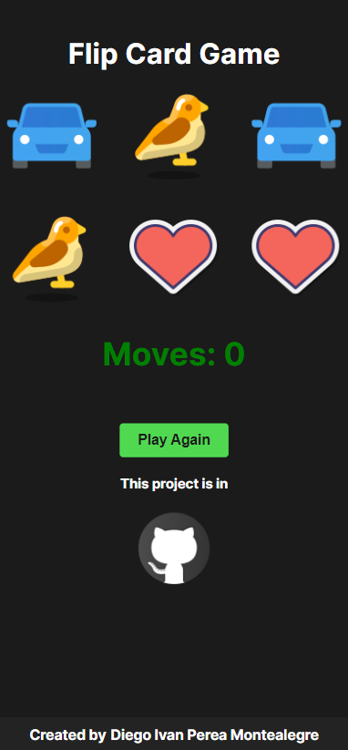
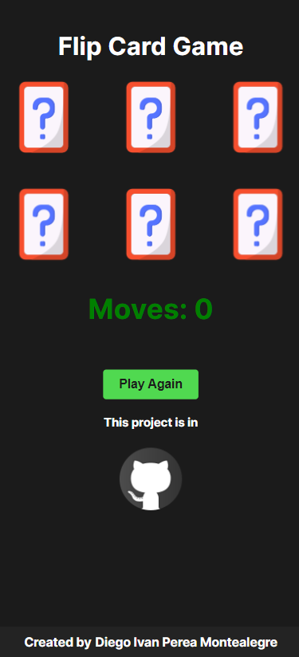
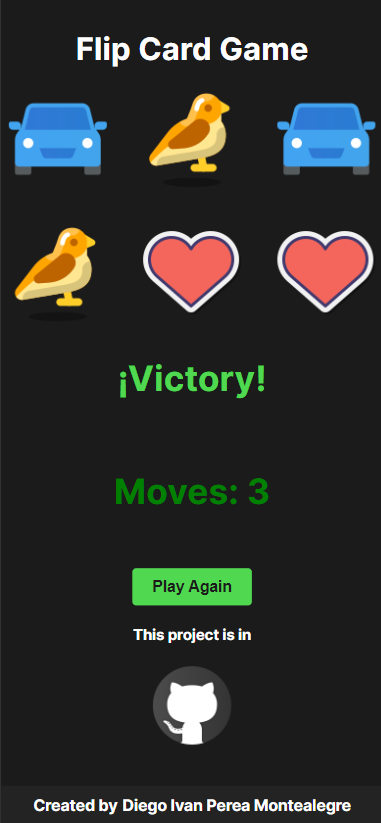
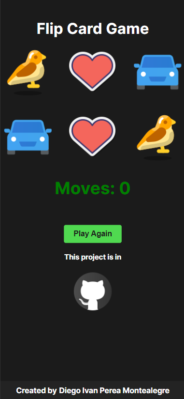
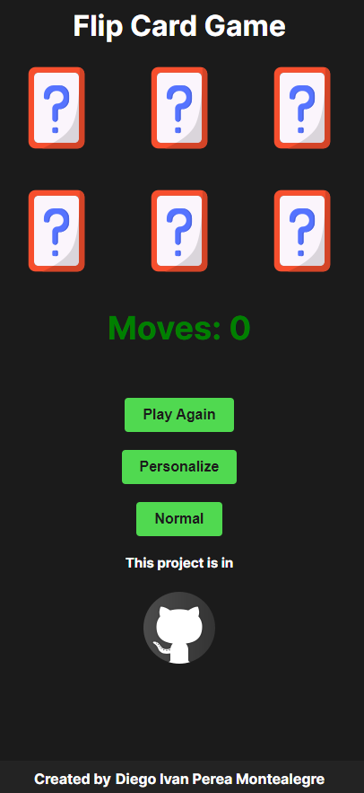
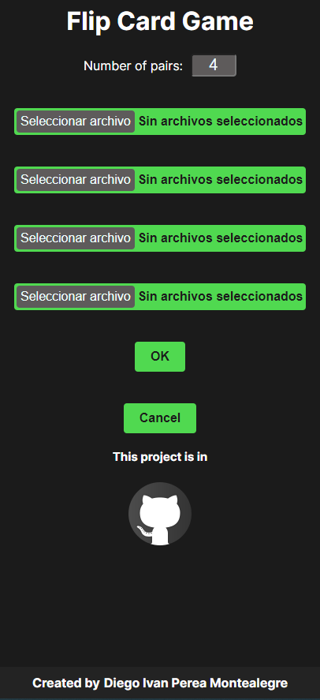
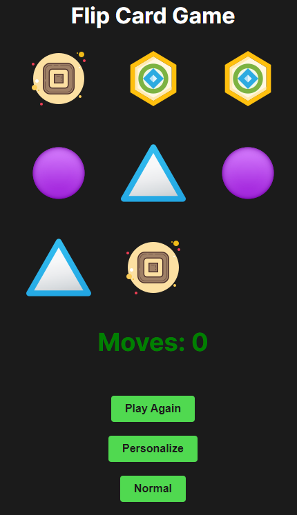
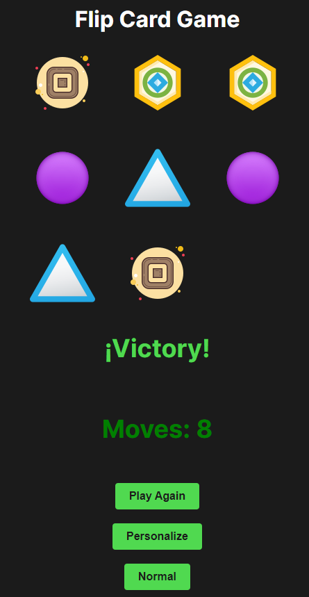

# Nextjs Flip Card Game

<p align="justify">
Nextjs Flip Card Game with diferents cards ,where you have to match the object in the image and you only have 5 seconds to memorize their positions and match them.
</p>

<p align="center">
  
</p>
After 5 seconds
<p align="center">
  
</p>
Match alls
<p align="center">
  
</p>
Play Again
<p align="center">
  
</p>

---
Personalize Mode

<p align="center">
  
</p>

Enter the number of pairs from 3 to 9

<p align="center">
  
</p>

Play personalize mode

<p align="center">
  
</p>

<p align="center">
  
</p>

if you want you can go back to normal mode 
----

Fronted Nextjs Options for do it:

This is a [Next.js](https://nextjs.org/) project bootstrapped with [`create-next-app`](https://github.com/vercel/next.js/tree/canary/packages/create-next-app).

## Getting Started
Nodejs version v20.10.0 and Next.js version v14.2.3 

First
```bash
npm install
```
run the development server:

```bash
npm run dev
# or
yarn dev
# or
pnpm dev
# or
bun dev
```

Open [http://localhost:3000](http://localhost:3000) with your browser to see the result.

## Resolve : Error Nextjs Parsing error: Cannot find module 'next/babel'

Put this code in .eslintrc.json 
```bash
{
  "extends": ["next/babel","next/core-web-vitals"]
}
```


Created by [Diego Ivan Perea Montealegre](https://github.com/diegoperea20)